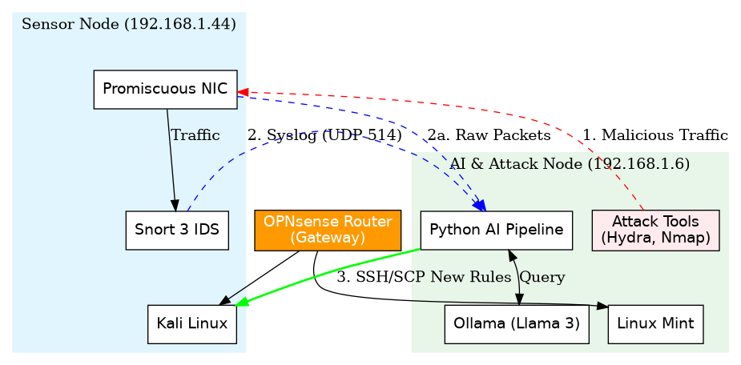

# AI-Enhanced Autonomous IDSA Cybersecurity Capstone Project

This repository contains the code for an AI-enhanced Intrusion Detection System (IDS) for the University of North Dakota (EECS 994). The system uses Snort 3 to detect network threats with custom rules and a Python-based machine learning pipeline to classify the resulting alerts. The ultimate goal is to create an autonomous system that can suggest new detection rules in response to emerging threats.

## About The Project

This repository contains the code for an AI-Enhanced Autonomous Intrusion Detection System (IDS) developed for the EECS 994 Capstone Project. As cyber threats evolve in complexity and volume, traditional signature-based IDS solutions, such as Snort, face diminishing returns. While effective against known threats, they are inherently blind to zero-day exploits and require significant manual intervention to update rule sets.

This project addresses these limitations by integrating a physical Snort 3 sensor with a hybrid machine learning pipeline. The system architecture utilizes a **Random Forest classifier** for precise categorization of known attack signatures and an **Isolation Forest** for unsupervised anomaly detection, trained on a massive composite dataset of over 6.5 million network flows.

Crucially, the system incorporates a novel autonomous feedback loop engineered using a local Large Language Model (Llama 3) to analyze raw packet payloads, generate valid Snort 3 signatures in real-time, and deploy them to the sensor. Experimental results demonstrate the system’s ability to detect novel SQL injection and HTTP exploits, automatically generate effective blocking rules, and validate them via a self-testing mechanism, achieving the goal of a self-healing network defense system.

## Technology Stack

*   **IDS Engine:** Snort 3
*   **Log Management:** Rsyslog
*   **Programming Language:** Python 3
*   **Core Libraries:** Pandas, Scikit-learn (Random Forest, Isolation Forest), Joblib
*   **LLM Integration:** Ollama with Llama 3
*   **Operating Systems:** Kali Linux (IDS) and Linux Mint (Attacker/AI Host)

## System Architecture

The system operates on a dedicated physical network to ensure accurate line-speed packet capture.



### Log Forwarding Pipeline
The log transfer from the Kali machine (Snort IDS) to the Linux Mint machine (AI/Attacker) happens through the Syslog protocol over the network.

1.  **Generation:** Snort on Kali detects an attack and generates an alert.
2.  **Internal Handoff:** Because `alert_syslog` is configured in `snort.lua`, Snort hands this alert message to the local logging service on Kali (Rsyslog), tagging it with the "facility" `local5`.
3.  **Network Transmission:** The Rsyslog service on Kali reads its config file (`/etc/rsyslog.d/60-snort.conf`). It sees the rule `local5.* @192.168.1.6:514`. This tells it to wrap the message in a UDP packet and send it to IP `192.168.1.6` on port 514.
4.  **Reception:** The Rsyslog service on the Mint machine is listening on UDP port 514 and receives the packet.
5.  **Filtering & Writing:** Rsyslog on Mint reads its config (`/etc/rsyslog.d/40-snort.conf`). It sees the rule `if $syslogfacility-text == 'local5' then /var/log/snort_alerts.log`. It recognizes the `local5` tag and writes the message into that specific text file.

This effectively creates a dedicated, invisible pipeline sending text messages from one operating system's log manager to another's.

### Parallel Packet Inspection
On the AI Node, a Python-based `packet_inspector.py` script utilizes **Scapy** to sniff raw packets in parallel. This parallel inspection architecture is critical; it allows the system to inspect payload contents for anomalies even if Snort does not trigger an alert, effectively acting as a secondary, ML-driven sensor. The inspector applies strict pre-filtering to minimize noise:
*   **Subnet Filtering:** Ignores traffic originating from the local subnet, with the exception of the Kali sensor IP.
*   **Port Exclusion:** Discards traffic destined for management ports (SSH/22) and the logging stream (Syslog/514).
*   **Payload Validation:** Only processes packets containing printable ASCII payloads of length > 5 bytes.

## Getting Started

### Prerequisites

*   Python 3 and pip
*   Ollama and the `llama3` model pulled (`ollama run llama3`)
*   Required Python libraries:
    ```bash
    pip3 install pandas scikit-learn joblib ollama
    ```

### Datasets

The full training datasets and PCAP files used in this project are hosted on OneDrive due to their size:
[Download Datasets](https://ndusbpos-my.sharepoint.com/:f:/g/personal/steven_iden_ndus_edu/IgDhMkXn1pLkQre811XoAkhEAWa_Lwo5zUMgldxKikeFqG8?e=1rg1Re)

### Lab Environment

The lab consists of two bare metal machines on an isolated network:

*   **Kali Snort IDS Machine:** `192.168.1.44`
*   **Linux Mint (Attacker) Machine:** `192.168.1.6`

### Snort Configuration

Snort 3 is configured via `/etc/snort/snort.lua`. Ensure `HOME_NET` is set to your lab network and that your custom rules file (`/etc/snort/rules/local.rules`) is included in the `ips` section.

To enable log forwarding to Rsyslog, add the following configuration to `snort.lua`:

```lua
-- Configure syslog to send alerts using a specific 'facility'
alert_syslog = {
    facility = 'local5',
    level = 'alert',
}

-- Activate ONLY the syslog logger
loggers = {
    'alert_syslog',
}
```

### Custom Snort Rules (Phase 1)

Five distinct custom rules were developed to detect specific attack vectors. Below is an explanation of the logic behind each signature:

1.  **SSH Brute-Force Detection**
    *   *Rule:* `alert tcp any any -> $HOME_NET 22 (msg:"SSH Brute-Force Attempt"; flow:to_server,established; content:"SSH-", nocase; detection_filter: track by_src, count 5, seconds 60; sid:1000002; rev:1;)`
    *   *Logic:* This rule monitors connection attempts to port 22. It acts as a tripwire for aggressive login attempts by tracking every source IP address individually. If it observes the same IP attempting to initiate an SSH handshake five times within a single 60-second window, it triggers an alert. This behavior is a clear signature of an automated brute-force tool like Hydra.

2.  **Nmap FIN Scan Detection**
    *   *Rule:* `alert tcp any any -> $HOME_NET any (msg:"Nmap FIN Scan Attempt"; flags: F,1; sid:1000001; rev:1;)`
    *   *Logic:* This rule acts as a silent alarm for stealthy reconnaissance. It inspects the TCP flags of every incoming packet. If it sees a packet where only the 'FIN' flag is set (and no others like SYN or ACK), it immediately generates an alert. This is unnatural behavior in normal networking and is a specific fingerprint of an Nmap FIN scan.

3.  **ICMP Ping Sweep Detection**
    *   *Rule:* `alert icmp any any -> $HOME_NET any (msg:"ICMP Ping Sweep Detected"; itype:8; icode:0; detection_filter: track by_src, count 2, seconds 10; sid:1000004; rev:1;)`
    *   *Logic:* This rule identifies attackers performing initial network mapping. It watches for ICMP Echo Requests (Type 8). While a single ping is normal, a rapid succession is suspicious. If the same source sends two or more pings within 10 seconds, it triggers the alert, indicating an automated sweep is in progress.

4.  **SQL Injection Detection**
    *   *Rule:* `alert udp any any -> $HOME_NET 3306 (content:"admin' UNION SELECT 1, database(), user() -- "; msg:"Possible SQL Injection"; metadata: former_category "Attempted Info Leak N-RPM"; sid:1764814600; rev:1;)`
    *   *Logic:* This rule looks for specific malicious payloads targeting database ports. It inspects the content of packets heading to port 3306 (MySQL). If the payload contains the exact string `admin' UNION SELECT`, it is an unambiguous sign of an SQL injection attempt aiming to exfiltrate database structure and user details.

5.  **Malicious Web Payload Detection**
    *   *Rule:* `alert tcp any any -> $HOME_NET 80 (content:"POST /upload.php HTTP/1.1\r\nHost: 192.168.1.6\r\nUser-Agent: curl/8.17.0\r\nAccept: */*\r\nContent-Length: "; msg:"Malicious Payload"; sid:1764814496; rev:1;)`
    *   *Logic:* This rule identifies a specific, known exploit script targeting the web server. It matches the exact HTTP header footprint of the attack tool, looking for a POST request to `/upload.php` combined with a specific User-Agent string. This precise matching prevents false positives while blocking the known attack tool.

### Machine Learning Pipeline (Phase 2)

To train a robust model, the system utilizes a hybrid dataset combining public academic data with custom local traffic captures:

*   **Public Datasets:** CIC-IDS-2017, CSE-CIC-IDS2018, UNSW-NB15, and CIC-DDoS-2019.
*   **Custom PCAPs:**
    *   `2025-01-04-four-days-of-scans-and-probes-and-webtraffic-hitting-my-web-server.pcap`: Four days of real-world noise and scanning activity.
    *   `2025-06-20-traffic-from-running-the-malware.pcap`: Isolated traffic patterns of specific malware samples.

These PCAPs were processed through Snort 3 to generate logs, which were then parsed and fed into the Random Forest classifier.

#### Feature Engineering
Raw packet logs were transformed into numerical features using the `train_model.py` script. Key engineered features included:
*   **`message_length`:** The length of the payload string.
*   **`special_char_count`:** A regex-based count of characters often used in exploits (`[${}´]`). This feature is particularly effective at identifying code injection attacks (e.g., Log4j, SQLi).
*   **`keyword_count`:** A heuristic count of suspicious terms drawn from a predefined dictionary (e.g., 'select', 'union', 'script', 'jndi', 'ldap').
*   **`TF-IDF Vectorization`:** The raw payload text was vectorized using Term Frequency-Inverse Document Frequency to highlight statistically significant words while filtering out common protocol noise.

#### Hybrid Detection Logic
To address the "zero-day" gap, the system employs a hybrid decision logic that combines supervised and unsupervised learning:
$$ Alert = (RF_{pred} == Malicious) \lor (IF_{pred} == -1) $$
*   **Random Forest (RF):** Classifies known attack signatures (Supervised).
*   **Isolation Forest (IF):** Detects statistical anomalies in traffic patterns (Unsupervised).
This ensures that even if the classifier misses a novel attack, the anomaly detector can still flag it as an outlier.

### Generative AI Model Selection (Phase 3)

A critical component of the autonomous system is the Large Language Model (LLM) responsible for analyzing packet payloads and generating Snort rules. Several models were evaluated for their ability to generate syntactically correct Snort 3 rules and their inference speed on local hardware:

*   `ministral-3:14b`
*   `codellama:7b`
*   `gemini-3-pro-preview:latest`
*   `gpt-oss:120b-cloud`
*   `llama3:latest`
*   `llama3.1:8b`

**Result:** `llama3.1:8b` yielded the best results. It consistently produced valid Snort syntax and was efficient enough for the local AI Node.

### Autonomous Agent Logic

To prevent the LLM from generating invalid or dangerous rules, a robust sanitization layer was implemented:
1.  **Prompt Engineering:** The system prompt explicitly restricts output to valid Snort 3 syntax.
2.  **Regex Extraction:** A greedy regular expression (`r'(alert\s+.*\))'`) is used to extract the rule from the LLM's response, ensuring nested parentheses are captured correctly.
3.  **Syntax Validation:** Before deployment, the system validates the rule's structure and ensures a unique SID is assigned.

### Offline Rule Mining
In addition to real-time generation, an offline analysis module (`mine_rules.py`) was developed to process historical alert logs. This script iterates through the aggregated CSV datasets, filtering for labeled malicious events that lack corresponding specific signatures. It utilizes a distinct prompt engineering strategy, instructing the LLM to act as a "Snort 3 Expert" and generate rules based on the message and `dest_port` fields. This dual-approach allows the system to learn from past incidents (batch processing) while simultaneously reacting to active threats (stream processing).

### The Validation Loop
The `validate_attack.py` script orchestrates the self-healing capability with a precise verification mechanism:
1.  **Snapshot:** Records the current file pointer position of the log file.
2.  **Replay:** Executes the specific attack payload against the sensor using `subprocess.run` with a timeout.
3.  **Verification:** Waits for network propagation and reads only new bytes from the log.
4.  **Confirmation:** Scans for the specific Snort ID (SID) generated by the LLM.
5.  **Deployment:** Validated rules are permanently appended to `local.rules` on the sensor.

### How to Run

1.  **Start the IDS:** On the Snort machine, run Snort to begin monitoring traffic.
    ```bash
    # (Optional) Ensure log directory exists with correct permissions
    # sudo mkdir -p /var/log/snort && sudo chown snort:snort /var/log/snort

    sudo snort -c /etc/snort/snort.lua -R /etc/snort/rules/local.rules -i eth0 -k none -l /var/log/snort
    ```

2.  **Monitor Live Logs:** On the Mint machine, view the live logs to confirm alerts are being received.
    ```bash
    sudo tail -f /var/log/snort_alerts.log
    ```

3.  **Generate Test Traffic:** From the Attacker machine, trigger the existing rules.
    ```bash
    # Ping Sweep, Nmap, and SSH Brute Force tests
    for i in {1..15}; do ping -c 1 192.168.1.44; done
    sudo nmap -sF 192.168.1.44
    hydra -l root -P /usr/share/wordlists/rockyou.txt -t 5 ssh://192.168.1.44
    ```

4.  **Run the AI Pipeline (Manual Method):** On the Snort machine, execute the Python scripts individually in order.
    ```bash
    # 1. Parse Snort logs into a structured CSV file
    python3 parse_logs.py
    
    # 2. Train the model and save it to disk
    python3 train_model.py
    
    # 3. Simulate a new threat and generate a rule suggestion
    python3 suggest_rule.py

    # (Optional) Run offline rule mining on historical data
    python3 mine_rules.py
    
    # 4. Review and deploy the suggested rules
    python3 approve_rules.py
    ```
    This will parse logs, train a hybrid model (Classifier + Anomaly Detector), detect threats, generate a new Snort rule using Llama 3, and allow for human-in-the-loop approval and deployment.

5.  **Run the AI Pipeline (Interactive Method):** Alternatively, use the master script to run the entire pipeline interactively.
    ```bash
    python3 run_pipeline.py
    ```
    This script combines parsing, training, rule suggestion, and approval into a single interactive session.

## Project Status

- [x] **Phase 1: IDS Deployment & Rule Creation** - Completed.
- [x] **Phase 2: AI-Enhanced Detection** - Data pipeline and baseline model complete.
- [x] **Phase 3: Autonomous Rule Suggestion** - Significant progress. Functional end-to-end prototype demonstrated.
    - [x] Implemented Hybrid Model (Random Forest + Isolation Forest).
    - [x] Successfully detected novel Log4j attack (missed by classifier, caught by anomaly detector).
    - [x] Integrated Ollama for autonomous rule generation.
    - [x] Created `approve_rules.py` for human-in-the-loop feedback and dynamic deployment.
    - [x] **Expand Model Knowledge:** Updated `train_model.py` to ingest UNSW-NB15, CICIoV2024, CICEV2023, and CSE-CIC-IDS2018 datasets.
    - [x] **Full "Lights-Out" Automation:** Created a master script (`run_pipeline.py`) to orchestrate the entire lifecycle.
- [ ] **Next Steps (Final Report):**
    1. **Automated Rule Validation:** Develop a script to re-launch attacks and verify that newly deployed rules successfully detect them.

## Future Work

While the current system demonstrates a functional proof-of-concept for autonomous defense, several avenues for future research and development remain:

*   **Transition to Intrusion Prevention (IPS):** The current system operates in Passive Mode (IDS). A logical next step is to configure Snort in Inline Mode (IPS), allowing the system to actively drop packets matching the autonomously generated rules. This would require rigorous safety checks to prevent self-inflicted Denial of Service (DoS).
*   **LLM Fine-Tuning:** The current implementation uses a general-purpose Llama 3 model. Fine-tuning a smaller model (e.g., Llama-3-8B or Mistral) specifically on a dataset of Snort rules and CVE descriptions could significantly improve inference speed and rule syntax accuracy.
*   **Adversarial Robustness:** Future work should evaluate the system’s resilience against adversarial attacks designed to poison the anomaly detector or trick the LLM into generating ineffective rules.

## Technical Challenges

*   **Memory Management:** Processing over 6.5 million records caused initial "OOM Killed" errors. A **Chunking Strategy** was implemented in the data loader, and the TF-IDF vectorizer was optimized to limit feature dimensionality, reducing RAM usage without sacrificing accuracy.
*   **LLM Hallucinations:** Early iterations saw the LLM outputting conversational text. The implementation of strict Regex parsing and the `approve_rules.py` sanitization layer acts as a compiler check, ensuring only executable code reaches the sensor.

## License

This project is licensed under the MIT License - see the `LICENSE` file for details.

## Acknowledgments

I would like to thank my capstone advisor, Dr. Zhang, for his guidance and support throughout this project. I also wish to acknowledge the Canadian Institute for Cybersecurity (CIC) for providing the CIC-IDS-2017 dataset, and the open-source communities behind Snort, Ollama, and Scikit-learn, whose tools made this project possible. Additionally, I thank Dr. Kim and the broader open source community for the tools and data sets utilized in this research.

All files, scripts, and documentation are available in this repository: https://github.com/Idowza/autonomous-snort-ids

## Example Output & Validation

The following outputs demonstrate the system's successful operation during live testing.

### 1. Model Training (`train_model.py`)
The model was trained on a massive composite dataset of **6,536,534 records**.
```text
[+] Total Processed Records: 6536534
Raw Class Distribution: {1: 3928465, 0: 2608069}
[+] Training Random Forest Classifier...
              precision    recall  f1-score   support
      Benign       1.00      1.00      1.00    521614
   Malicious       1.00      1.00      1.00    785693
    accuracy                           1.00   1307307
```

### 2. Autonomous Rule Generation (`packet_inspector.py`)
The system detects a live SQL Injection attack and autonomously generates a Snort 3 signature.
```text
[ALARM] MALICIOUS PACKET from 192.168.1.44
Payload: admin' UNION SELECT 1, database(), user() -...
[!] AI Generating Rule for 192.168.1.44 -> Port 3306...
Proposed Rule: alert udp any any -> $HOME_NET 3306 (content:"admin' UNION SELECT 1, database(), user() -"; msg:"Possible SQL Injection"; metadata: former_category "Attempted Info Leak N-RPM"; sid:1764814600; rev:1;)
```

### 3. Rule Validation (`validate_attack.py`)
The system replays the attack to verify the new rule triggers an alert.
```text
[2] Executing Attack...
[+] Launching Attack: echo "admin' UNION SELECT 1, database(), user() -- " | nc -u 192.168.1.44 3306
[4] Verifying Detection...
[SUCCESS] Validation Passed! Rule Triggered.
Captured Alert: 2025-12-03T20:22:05-06:00 kali snort: [1:1764814600:1] "Possible SQL Injection" {UDP} 192.168.1.6:37609 -> 192.168.1.44:3306
```
